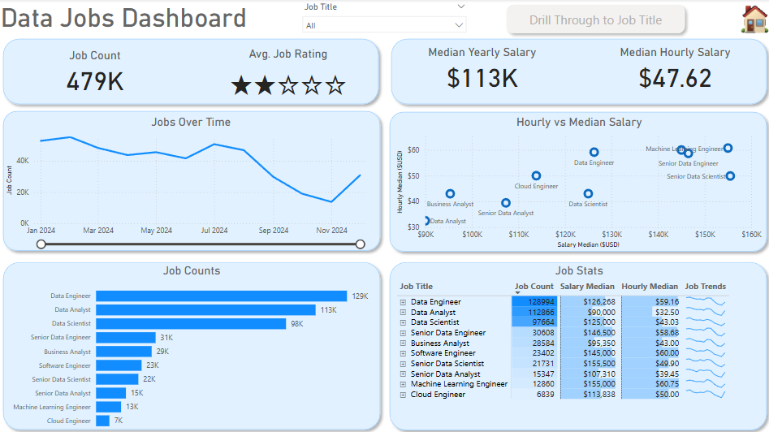
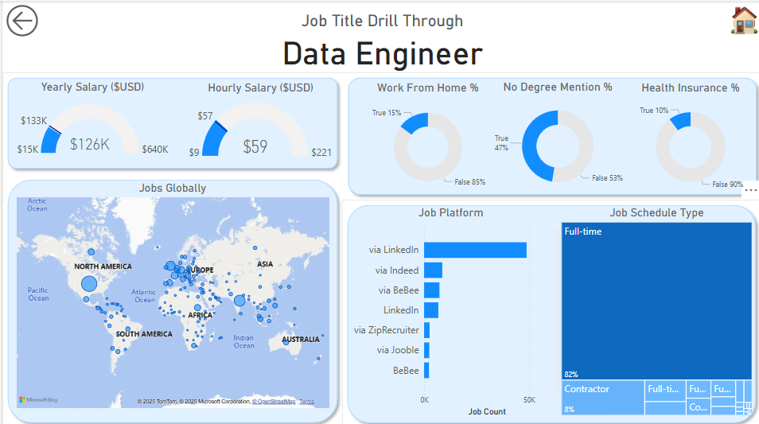

# This is an ongoing Readme about the project.

## Introduction

# 📊 Data-Related Jobs Dashboard Collection

Welcome to my repository of Power BI dashboards exploring **data-related jobs**: salaries, skills demand, job trends, and market analysis.

This project aims to help data professionals, recruiters, and analysts better understand the data-related job landscape.

---

## 🚀 Project Overview

This repository contains interactive *Power *BI dashboards built from multiple datasets related to data jobs. Topics covered include:

- 📈 **Salary analysis** across roles, industries, and regions
- 🌎 **Geographic trends** in demand for data professionals
- 🛠️ **Skills and tools** most in-demand
- ⏳ **Temporal trends** in hiring and job postings

Each dashboard is designed for clear insights, with filters for custom exploration.

---
## Dashboard 1 Overview

### Page 1 : High level Market View

! Dashboard parge

# 📊 Data Jobs Power BI Dashboards

This project showcases interactive Power BI dashboards analyzing the **data-related job market**. Using real-world job listing data, the dashboards provide insights into demand, salaries, skills, and hiring trends for roles such as Data Engineer, Data Analyst, and Data Scientist.

---

## 🚀 Features

- **Overall Market View**
  - Total job counts and trends over time
  - Median yearly and hourly salary benchmarks
  - Breakdown of roles by job counts
  - Hourly vs. yearly salary comparison
  - Interactive filters by job title

- **Drill-Through Details**
  - Specific role deep-dives (e.g. Data Engineer)
  - Global job distribution map
  - Salary gauges for yearly and hourly rates
  - Work-from-home, degree requirements, and benefits stats
  - Job platform sources and schedule types

---

## 📸 Dashboard Previews

### Data Jobs Dashboard
A global overview with job counts, salary stats, temporal trends, and role breakdowns.

---

### Job Title Drill-Through (Data Engineer)
Detailed insights for the selected role, including salary ranges, global demand map, and hiring details.

---

## 💡 Purpose

These dashboards are designed to:

- Help **job seekers** explore salary expectations and demand for specific roles
- Inform **recruiters** and **HR teams** about hiring trends and platforms
- Support **data professionals** in analyzing industry dynamics

---

## ⚙️ Usage

- Open the `.pbix` files in Power BI Desktop
- Explore with built-in filters and drill-through capabilities
- Connect to included sample data or your own datasets

---

## 📜 License

This project is shared under the MIT License. Feel free to adapt it for your own analyses!

---

## 👤 Author

Data Analyst passionate about turning job market data into clear, actionable insights.

- [LinkedIn](https://your-linkedin.com/in/thangnguyendinh/)
- [Email](mailto:ndthang514@example.com)

